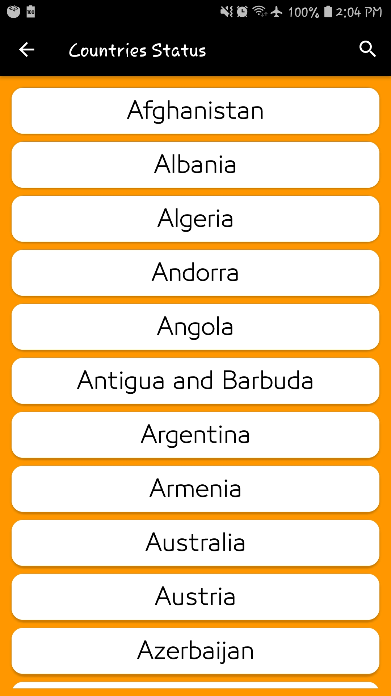

# CoronaTracker
This repository is for my new app called CoronaTracker which tracks and shows updated statistics about Corona virus.

Here are the development process of the app, and some screen shots while it is running

 

 

 

 

 

 

 

